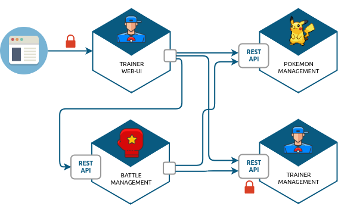
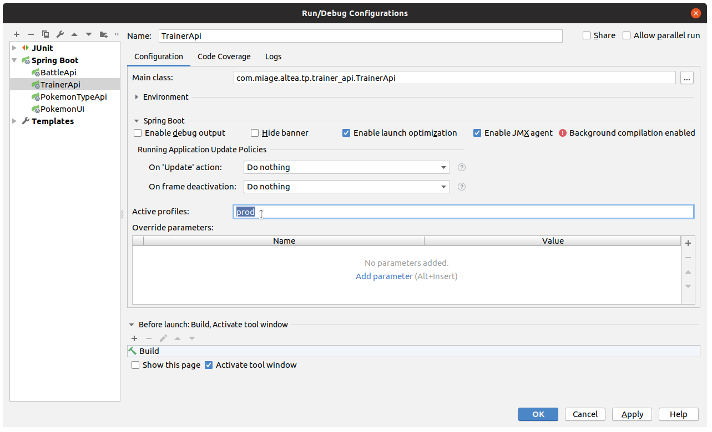
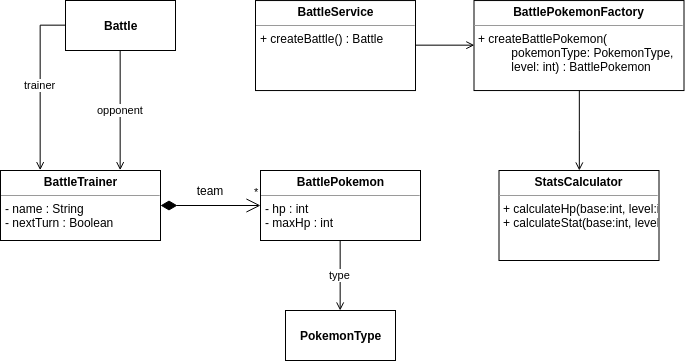
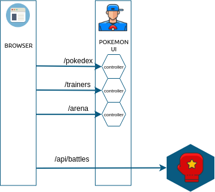
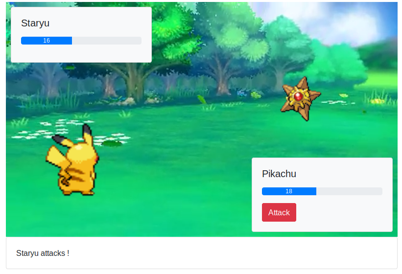

:source-highlighter: pygments
:prewrap!:

:icons: font

:iconfont-cdn: https://use.fontawesome.com/releases/v5.4.2/css/all.css

:toc: left
:toclevels: 4

:linkattrs:

:sectlinks:
:sectanchors:
:sectnums:

:experimental:

:stem:

= ALTEA - TP 9 - Practice even more !

== Présentation et objectifs

Le but est de continuer le développement de notre architecture "à la microservice".

Nous allons aujourd'hui :

* gérer la configuration de nos micro-services en mode multi-environnements
//* déployer nos micro-services sur Clever-Cloud
* continuer (ou commencer) le développpement de notre micro-service de combat !

.Notre architecture !

TIP: Pendant ce TP, nous faisons évoluer les TP précédents !

== La configuration des micro-services

NOTE: Cette partie est idéale si vous souhaitez déployer en ligne !

Pour le moment, nos micro-services sont configurés via le fichier `application.properties`, présent dans le répertoire
`src/main/resources` de chacun de nos micro-services.

Cela nous empêche de travailler efficacement, car nous souhaiterions séparer la configuration de `dev`, de la `prod`.
En `dev`, nos micro-services sont instanciés sur notre poste de développement, le fichier de configuration ressemble
alors à quelque chose similaire à :

[source]
.application.properties de `dev` de pokemon-ui
----
server.port=9000

# <1>
pokemonType.service.url=http://localhost:8080
# <1>
trainer.service.url=http://localhost:8081
trainer.service.username=user
trainer.service.password=e0aca759-58c9-41a1-a61c-997ceadda24c
----
<1> Notre configuration de `dev` utilise les services sur `localhost` !

[source]
.application.properties de `dev` de trainer-api
----
server.port=8081

spring.security.user.name=user
spring.security.user.password=e0aca759-58c9-41a1-a61c-997ceadda24c
----

La configuration de `dev` est celle s'appuyant sur `localhost`, et sur une base de données embarquée (pour trainer-api par exemple).

La configuration de `prod` s'appuiera sur les services déployés, et sur une base instanciée sur un cloud.

=== pokemon-type-api

`pokemon-type-api` ne porte pas de configuration particulière. Nous n'avons rien à faire ici !

=== trainer-api

`trainer-api` utilise une base de données !

En production, nous souhaitons que la base de données utilisée soit celle que nous avons à disposition chez notre provider de cloud !

==== Les properties

Créez donc un fichier de configuration `application-prod.properties` dans votre répertoire `src/main/resources`

[source,properties]
.src/main/resources/application.properties
----
logging.level.web=TRACE
# <1>
server.port=8081

spring.security.user.name=user
spring.security.user.password=e0aca759-58c9-41a1-a61c-997ceaada24c
----
<1> le port d'écoute sur le profil par défaut !

[source,properties]
.src/main/resources/application-prod.properties
----
logging.level.web=TRACE

# <1>
server.port=8080

# <2>
spring.security.user.name=production-user
spring.security.user.password=826e9de4-123e-489a-b88d-acc7fd4394b4

# <3>
spring.datasource.url=jdbc:postgresql://bpxzmr4f1jphpzy1nb8-postgresql.services.clever-cloud.com:5432/bpxzmr4f1jphpzy1nb8
spring.datasource.username=uolwyvtadid7cwldpz9
spring.datasource.password=3BW9SOWXQnaaqD3Mmrj

spring.jpa.hibernate.ddl-auto = create-drop

spring.datasource.hikari.maximum-pool-size=1
----
<1> sur la production, le port d'écoute peut être 8080 (le port par défaut)
<2> c'est également une bonne idée de modifier la configuration de la sécurité pour la production !
<3> la configuration de production utilise la base de données !

==== L'utilisation du profil

===== En ligne de commande

Pour activer un profil spring-boot, vous pouvez ajouter un paramètre à votre lancement en ligne de commande :

[source,bash]
.Le lancement sans profil
----
$> mvn spring-boot:run
----

[source,bash]
.Le lancement pour la production
----
$> mvn spring-boot:run -Dspring.profiles.active=prod
----

===== Avec IntelliJ

Vous pouvez activer les profils spring via l'écran `Run Configuration` :

=== pokemon-ui

TIP: pokemon-ui nécessite aussi probablement une configuration spécifique !

//== Le déploiement sur clever-cloud
//
//Pour déployer sur clever-cloud, il faut leur préciser quel target maven démarrer.
//
//Pour ce faire, clever-cloud nécessite qu'un fichier de configuration soit déposé à la racine des projets.
//Pour des applications de type `java+maven`, le fichier est le suivant :
//
//[source,javascript]
//.clevercloud/maven.json
//----
//{
//  "deploy": {
//    "goal": "spring-boot:run"
//  }
//}
//----
//
//Pour activer la configuration de production, il suffit de préciser le profil, comme cela est fait en ligne de commande :
//
//[source,javascript]
//.clevercloud/maven.json
//----
//{
//  "deploy": {
//    "goal": "spring-boot:run -Dspring.profiles.active=prod"
//  }
//}
//----
//
//WARNING: Utilisez bien l'organisation qui nous est offerte !

== `battle-api`

Nous reprennons (ou commençons) dans ce TP le développement du service de combats, que nous continuerons la semaine prochaine !

=== Projet Github

Cliquez sur le lien suivant pour initialiser votre projet sur Github : https://classroom.github.com/a/0zcdPtV-[Github classroom,window="_blank"]

=== Stats des Pokemons

Les types de Pokemon ont des statistiques de base :

* vitesse
* attaque
* défense
* hp

Chaque Pokemon, en fonction de son niveau, aura des statistique qui s'appuient sur ces statistiques de base.
Pour les statistiques de vitesse, d'attaque et de défense, la statistique du pokemon est:

asciimath:[stat=5+(baseStat * (niveau)  / 50)]

Les points de vie du Pokemon sont calculés avec cette formule :

asciimath:[stat=10+niveau+(baseStat * (niveau)  / 50)]

NOTE: Un pokemon de niveau 50 a les stats de base + 5, et un nombre de points de vie égal aux stats de base + 60.
Un pokemon de niveau 100 a les stats de base * 2 + 5, et un nombre de points de vie égale à la stat de base * 2 + 110

Pour donner un exemple concret :

Pikachu a les stats de base suivantes :

.Les stats de base de Pikachu
|===
| attack  | 55
| defense | 40
| speed   | 90
| hp      | 35
|===

Un pikachu de niveau 5 a les stats suivantes :

.Quelques niveaux de pikachu
[options="header"]
|===
|pikachu  |niveau 6|niveau 18|niveau 50|niveau 100
| attack  | 11     | 24      | 60      | 115
| defense | 9      | 19      | 45      | 85
| speed   | 15     | 37      | 95      | 185
| hp      | 20     | 40      | 95      | 180
|===

=== Attaque et défense

Lors d'un combat, quand un pokémon en attaque un autre, il lui inflige des dégat qui sont retirés des points de vie du pokemon attaqué.

La formule pour calculer les dégats infligés par une attaque est :

.La formule des dégats, avec n le niveau du pokemon attaquant, a sa statistique d'attaque, et d la statisque de défense du pokemon adverse.
asciimath:[( ( (2*n)/5 + 2 * a / d ) + 2 )]

=== Règles du combat

Le combat se déroule en tour par tour.

Lors d'un tour, chaque dresseur de pokemon peut donner un ordre à son pokemon (attaquer), ou utiliser un objet (potion, etc...).

C'est le dresseur dont la stat de vitesse du pokemon est la plus élevée qui commence. Suivi de l'autre dresseur.

Si pendant un tour la vie de l'un des deux pokemons tombe à 0, il est KO. C'est le pokemon suivant du dresseur qui prend la suite, et un nouveau tour commence.

=== Utilisation de l'API

Dans un premier temps, notre API de combat devra exposer les routes suivantes :

* POST /battles : Prend 2 paramètres (noms des 2 dresseurs en paramètres). Crée une instance de combat, et retourne un `UUID` permettant de l'identifier.
* GET /battles : liste les combats en cours
* GET /battles/{uuid} : Récupère l'état d'un combat en cours
* POST /battles/{uuid}/{trainerName}/attack : Permet à un dresseur de donner un ordre d'attaque pendant le combat. Retourne l'état du combat.
  1. Si le trainer attaque quand ce n'est pas son tour, renvoie une erreur 400 BAD REQUEST

Le combat prend la forme suivante :

.Le combat au format JSON
[source,javascript,linenums]
----
{
    "uuid": "781c2cc7-1681-4c6a-a94f-0445a0629453",
    "trainer": {
        "name": "Ash",
        "team": [
            {
                "id": 1,
                "type": {
                    "id": 25,
                    "baseExperience": 112,
                    "height": 4,
                    "name": "Pikachu",
                    "stats": {
                        "speed": 90,
                        "defense": 40,
                        "attack": 55,
                        "hp": 35
                    },
                    "weight": 60,
                    "sprites": {
                        "back_default": "https://raw.githubusercontent.com/PokeAPI/sprites/master/sprites/pokemon/back/25.png",
                        "front_default": "https://raw.githubusercontent.com/PokeAPI/sprites/master/sprites/pokemon/25.png"
                    }
                },
                "maxHp": 40,
                "attack": 24,
                "defense": 19,
                "speed": 37,
                "level": 18,
                "hp": 40,
                "ko": false,
                "alive": true
            }
        ],
        "nextTurn": true
    },
    "opponent": {
        "name": "Misty",
        "team": [
            {
                "id": 2,
                "type": {
                    "id": 120,
                    "baseExperience": 68,
                    "height": 8,
                    "name": "Staryu",
                    "stats": {
                        "speed": 85,
                        "defense": 55,
                        "attack": 45,
                        "hp": 30
                    },
                    "weight": 345,
                    "sprites": {
                        "back_default": "https://raw.githubusercontent.com/PokeAPI/sprites/master/sprites/pokemon/back/120.png",
                        "front_default": "https://raw.githubusercontent.com/PokeAPI/sprites/master/sprites/pokemon/120.png"
                    }
                },
                "maxHp": 38,
                "attack": 21,
                "defense": 24,
                "speed": 35,
                "level": 18,
                "hp": 38,
                "ko": false,
                "alive": true
            },
            {
                "id": 3,
                "type": {
                    "id": 121,
                    "baseExperience": 182,
                    "height": 11,
                    "name": "Starmie",
                    "stats": {
                        "speed": 115,
                        "defense": 85,
                        "attack": 75,
                        "hp": 60
                    },
                    "weight": 800,
                    "sprites": {
                        "back_default": "https://raw.githubusercontent.com/PokeAPI/sprites/master/sprites/pokemon/back/121.png",
                        "front_default": "https://raw.githubusercontent.com/PokeAPI/sprites/master/sprites/pokemon/121.png"
                    }
                },
                "maxHp": 56,
                "attack": 36,
                "defense": 40,
                "speed": 53,
                "level": 21,
                "hp": 56,
                "ko": false,
                "alive": true
            }
        ],
        "nextTurn": false
    }
}
----

Le calcul des dégat se fait bien côté serveur.

L'API battle doit donc :

* appeler l'API trainers pour récupérer les équipes des deux dresseurs lorsqu'un nouveau combat est créé
* stocker le combat (en mémoire pour commencer)
* appeler l'API PokemonTypes pour récupérer les statistiques de base des types de Pokemon et calculer les valeurs des statisques des Pokemons en fonction de leur niveau
* Lors d'un appel à `/attack`, effectuer une attaque entre les deux pokemons, en calculant les dégâts, et retourner le résultat.

Voici une collection Postman qui vous permet de valider votre API : link:battle-api.postman_collection.json[battle-api.postman_collection.json,window="_blank"]

=== UML

Voici un exemple de diagramme UML pour vous donner l'inspiration :)

.Battle UML

== `pokemon-ui`

=== Proxy gateway entre `pokemon-ui` et `battle-api`

Pour éviter de devoir re-développer dans pokemon-ui l'ensemble des objets liés au combat, nous allons utiliser un gateway.

==== Configuration

Le proxy que nous allons utiliser s'appuie sur Zuul, un composant développé par netflix.

Ajoutez le bloc suivant dans votre pom.xml

[source,xml]
.pokemon-ui/pom.xml
----
<dependencyManagement>
    <dependencies>
        <dependency>
            <groupId>org.springframework.cloud</groupId>
            <artifactId>spring-cloud-dependencies</artifactId>
            <version>Greenwich.RELEASE</version>
            <type>pom</type>
            <scope>import</scope>
        </dependency>
    </dependencies>
</dependencyManagement>
----

ainsi que la dépendance suivante :

[source,xml]
.pokemon-ui/pom.xml
----
<dependency>
    <groupId>org.springframework.cloud</groupId>
    <artifactId>spring-cloud-starter-netflix-zuul</artifactId>
</dependency>
----

Ajoutez les properties suivantes dans votre application.properties

[source,properties]
.pokemon-ui/src/main/resources/application.properties
----
# <1>
battle.service.url=http://localhost:8082
# <2>
zuul.routes.battle.path=/api/battles/**
# <3>
zuul.routes.battle.url=${battle.service.url}/battles/
----
<1> L'url du battle-api
<2> On configure le proxy-gateway pour écouter les routes `/api/battles/**`
<3> On indique que toutes les requêtes arrivant sur ces routes doivent être envoyées à `${battle.service.url}/battles/`

Ajoutez enfin l'annotation `@EnableZuulProxy` sur une classe de configuration :

[source,java,linenums]
.RouterConfig.java
----
package com.miage.altea.tp.pokemon_ui.config;

import org.springframework.cloud.netflix.zuul.EnableZuulProxy;
import org.springframework.context.annotation.Configuration;

@EnableZuulProxy
@Configuration
public class RouterConfig {
}
----

Cette configuration permet de réaliser ce qui est présenté sur ce schéma:

.Le proxy-gateway

De cette manière, les requêtes envoyées à `<pokemon-ui>/api/battles/` sont transmises directement au `battle-api` !

==== Désactivation de CSRF sur les routes `/api`

Nous devons désactiver la protection `CSRF` sur les routes API afin de rendre le tout directement appelable via des requêtes AJAX.

Ajoutez la configuration suivante dans votre `SecurityConfig` :

[source,java,linenums]
.SecurityConfig.java
----
@Override
protected void configure(HttpSecurity http) throws Exception {
    super.configure(http);
    http.csrf().ignoringAntMatchers("/api/**"); //<1>
}
----
<1> On dit à spring-security de désactiver le CSRF sur les routes `/api/**` qui sont gérées en proxy !

=== Ecran de combat !

Pour vous faciliter le travail, j'ai développé pour vous un écran simple de combat, ainsi qu'un javascript (vanilla), qui
requête en AJAX la nouvelle route `/api/battles/**` du pokemon-ui, et permet de jouer un combat !

.Un combat en cours !

Le JS est disponible ici : link:battle.js[battle.js,window="_blank"].

L'image de fond est disponible ici : link:images/battle_background.png[battle_background.png,window="_blank"].

L'écran de jeu est défini en template mustache via le code suivant :

[source,xml]
.fight.html
----
<!doctype html>
<html lang="en">
<head>
    <!-- Required meta tags -->
    <meta charset="utf-8">
    <meta name="viewport" content="width=device-width, initial-scale=1, shrink-to-fit=no">
    <title>Pokemon Manager</title>

    <!-- Bootstrap CSS -->
    <link rel="stylesheet" href="https://stackpath.bootstrapcdn.com/bootstrap/4.2.1/css/bootstrap.min.css" integrity="sha384-GJzZqFGwb1QTTN6wy59ffF1BuGJpLSa9DkKMp0DgiMDm4iYMj70gZWKYbI706tWS" crossorigin="anonymous">

    
    <link rel="stylesheet" href="https://cdnjs.cloudflare.com/ajax/libs/animate.css/3.7.0/animate.min.css">
</head>

<body>

    <h1 class="pt-md-5 pb-md-5">Arena </h1>

    <h2>{{trainerName}} Vs {{opponentName}}</h2>

    

        
        

        

            

                <h5 class="card-title" id="{{trainerName}}-pokemon-name"></h5>
                

                    

                        

                    

                

                <button class="btn btn-danger" id="attack-btn" onclick="playerCommand('ATTACK');">Attack</button>
            

        

        

            

                <h5 class="card-title" id="{{opponentName}}-pokemon-name"></h5>
                

                    

                        

                    

                

            

        

    

    

    

</body>
</html>
----

Le template a besoin de 2 variables : `trainerName` et `opponentName`.

Le fichier `battle.js` doit être déposé dans `src/main/resources/static/scripts`.
L'image de fond doit être déposée dans `src/main/resources/static/images`.

Le combat utilise `Bootstrap`, `JQuery` et `Animate.css`.

==== Le controller

Le controlleur servant cet écran peut être codé de cette manière :

[source,java,linenums]
.BattleController.java
----
@GetMapping("/fight/{opponent}")
public ModelAndView fight(Principal principal, @PathVariable String opponent){
    var modelAndView = new ModelAndView("fight");

    modelAndView.addObject("trainerName", principal.getName());
    modelAndView.addObject("opponentName", opponent);

    return modelAndView;
}
----

De cette manière, on peut déclencher un combat en se rendant sur l'URL http://localhost:9000/fight/Misty[,window="_blank"]
